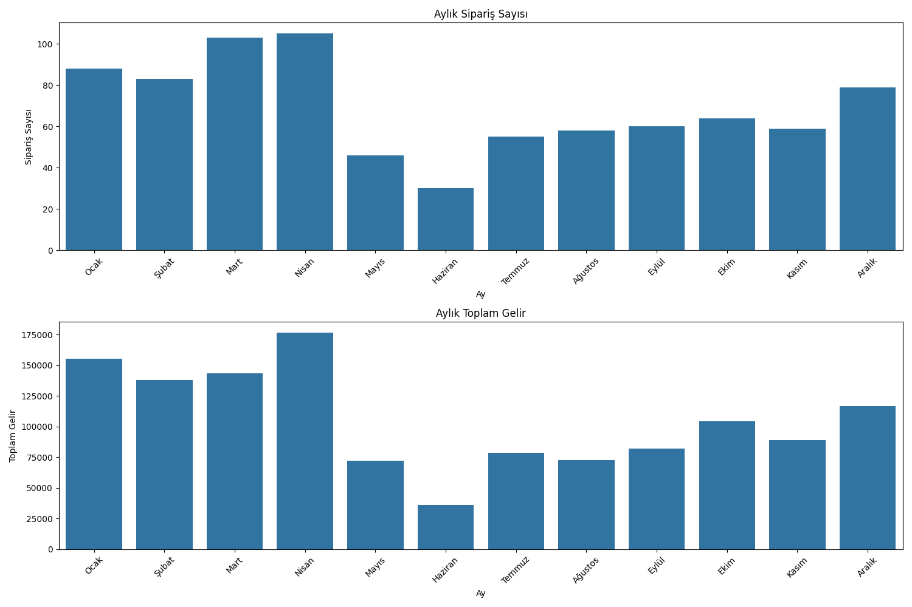

# Müşteri Tahmin API

Bu proje, müşteri davranışlarını tahmin eden bir REST API uygulamasıdır. FastAPI kullanılarak geliştirilmiştir.

## Özellikler

- Tek müşteri için tahmin yapma
- Tüm müşteriler için toplu tahmin
- RESTful API endpoints
- Swagger UI desteği

## Kurulum

1. Gerekli paketleri yükleyin:
```bash
pip install -r requirements.txt
```

2. API'yi çalıştırın:
```bash
python api.py
```

3. Tarayıcınızda şu adresi açın:
```
http://127.0.0.1:8000/docs
```

## API Endpoints

- `GET /`: Ana sayfa
- `POST /tahmin`: Tek müşteri için tahmin
- `GET /tum-tahminler`: Tüm müşteriler için tahminler

## Test

Test etmek için:
```bash
python test_api.py
```

## Gereksinimler

- Python 3.8+
- FastAPI
- scikit-learn
- pandas
- uvicorn 
